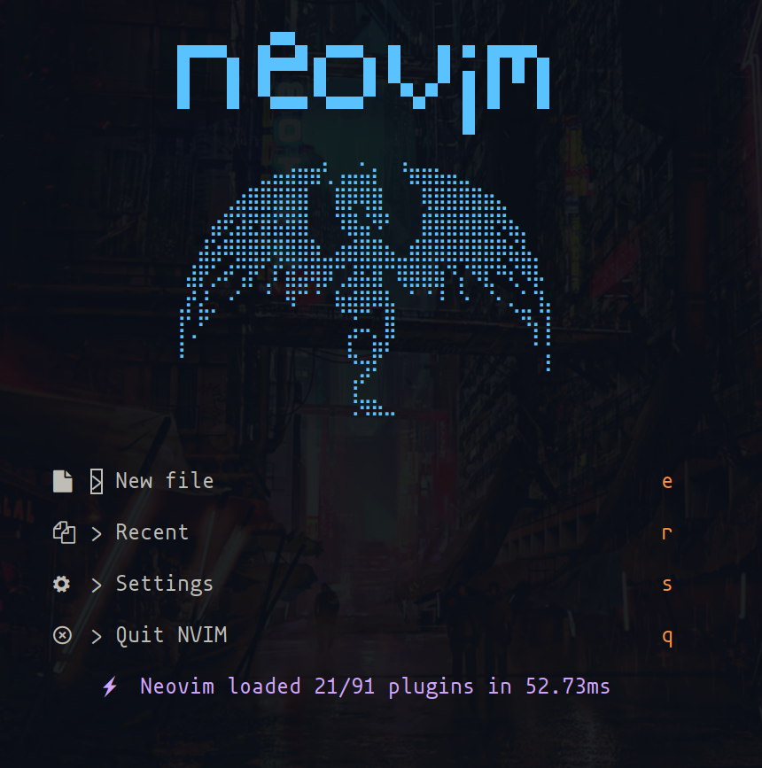

# Neovim Configuration

My personal Neovim setup. Uses Lua and includes plugins I find useful for development.



## What's included

- LSP setup with completion and diagnostics
- Treesitter for syntax highlighting
- Telescope for file navigation
- Git integration (fugitive, neogit, diffview)
- AI assistant (Avante)
- Task management for markdown
- DAP for debugging
- LaTeX support
- Database tools
- Obsidian integration

## Setup

Run the setup script:

```bash
./install.sh
```

This creates a `globals.lua` file where you can set personal paths and preferences (like your Obsidian vault location). The file is gitignored so your personal settings stay private.

## Structure

```
├── lua/core/           # LSP and plugin configs
├── lua/commands/       # Custom commands
├── after/              # Language-specific configs
├── ftplugin/           # Filetype settings
└── lua/globals.lua     # Your personal settings
```

## Usage

1. Run `./install.sh`
2. Edit `lua/globals.lua` for your paths
3. Open Neovim - plugins install automatically
4. Customize as needed
